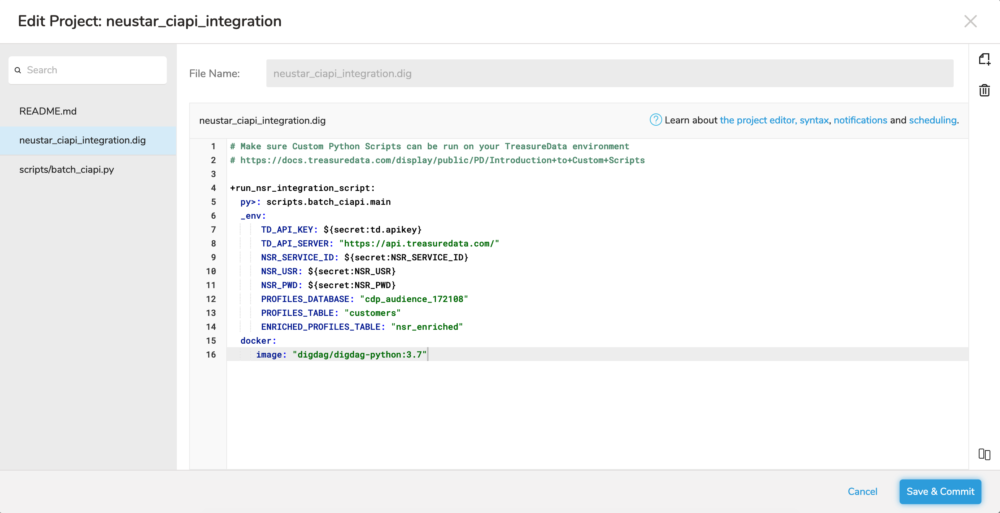

# Neustar Customer Identity (CI-API) Integration

A Treasure Box that can be used by a Treasure Data customer to enrich their first-party using  Neustar's CI API.

## Integration Overview

The Neustar CI API (CI API) provides a customer to use a variety of features of the powerful Neustar Identity Graph:

* Address standardisation.
* Matching a consumer's PII to Neustar's data and enriching.
* Advanced 1st party data identity resolution through Neustar OneID™.

The following guide demonstrates the integration of a Treasure Data workflow with Neustar CI API Service. 
<div align="center">
    
</div>


## Getting Started

1) Contact Neustar CI API (<ciapi@team.neustar>) team to get your credentials. A **Service ID (or SID)**, **Username** and **Password** will be provided.
2) Ensure that your Treasure Data environment is configured to allow running custom **[python scripts](https://docs.treasuredata.com/display/public/PD/Introduction+to+Custom+Scripts)**.
3) Install the **[Treasure Data Toolbelt](https://toolbelt.treasuredata.com/)** on your local machine (supports MacOS, Linux & Windows). Once installed, login into your Treaure Data environment remotely by running `td account`.
```
td account
```

## Steps
1) Download the Treasure Box by cloning this repository to your local machine and then `cd` into it.
```
git clone ssh://git@git.nexgen.neustar.biz:8022/treasurebox/neustar_treasurebox.git nsr_tb
cd nsr_tb
```
2) Upload this Treasure Box to your Treasure Data environment by using the Toolbelt. If you are performing this operation for the first time, the Toolbel will require you to install the `workflow` module.
```
td wf push neustar_ciapi_integration                                                                       
```

3) Now login into your **[Treasure Data Console](https://console.treasuredata.com/)** in a browser to confirm that the workflow has been uploaded successfully.
<div align="center"> 
    
</div>

4) It is now time to configure the credentials obtained from Neustar into the workflow. Select the **neustar_ciapi_integration** and navigate to the **Secrets** tab. Click on the **+ Icon**.
<div align="center">
    .
</div>

5) In the modal dialog window that opens enter each of the 3 secrets as shown below.
    - NSR_SERVICE_ID
    - NSR_USR
    - NSR_PWD
<div align="center">
    
</div>

6) Next, obtain the name of the database wherein all the profiles in your Treasure Data environment have been created. This can be found under **Data Workbench** > **Databases** and will usually start with `cdp_audience`.
<div align="center">
    
</div>

7) Navigate back to the Neustar workflow and update this database name by clicking on **Project Editor** button. In the resulting modal window, select the `neustar_ciapi_integration.dig` file to edit and then click on **Edit Files**. 
    - Change `PROFILES_DATABASE` to the value obtained earlier.
    - Change `ENRICHED_PROFILES_TABLE` to your desired value or leave as is.
Once the changes are made, click on **Save And Commit** as shown below.
<div align="center">
    
</div>

8) Click on **New Run** to run the workflow. Alternatively, select **Customize Details** in the dropdown to schedule the workflow to run daily. All the instances of the run will be visible under the **Run History** tab.
<div align="center">
    
</div>

## Support
For any queries around the Treasure Box, contact <divaritosh.singh@team.neustar>.